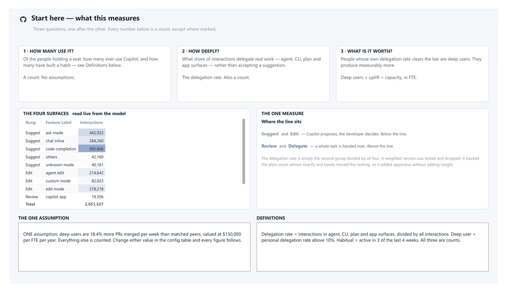
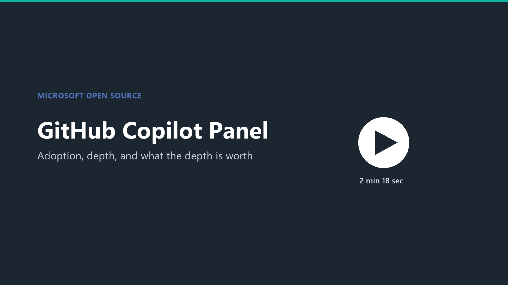

# GitHub Copilot Panel

**A Power BI template for GitHub Copilot adoption, engagement depth and realised value.**

Built on the Viva Insights **GitHub Copilot** query output. One template, two ways to
feed it: a local CSV export, or the Viva Insights connector direct.

Seven pages, 120 measures, every assumption in one table.

## Watch first

**Intro — what the report covers, page by page** *(2m 18s)*

<!-- An inline player needs a github.com/user-attachments URL, and those are only
     minted by GitHub's web uploader - the endpoint rejects token auth, so this
     could not be done from the API. Release-download, raw.githubusercontent,
     /raw/ and /blob/ URLs were all tested against the real README rendering
     pipeline and every one renders as a plain link.

     To turn this into a player: drag media/GitHubCopilotPanel-Demo.mp4 into any
     GitHub comment box, wait for the upload, copy the user-attachments URL, and
     replace the poster link below with that bare URL on its own line.
     See docs/PREVIEW.md. -->

---

> ### This proves behaviour change, not output change.
>
> The report shows people moving from autocomplete to delegation, and prices that
> movement. The bridge between the two is `deep_user_uplift`, which is an **input, not
> a finding**. Say so before anyone asks. A value model that states its own assumption
> is auditable; one that hides it will be assumed inflated.

---

## Try it in about ten minutes

1. Download **`GitHub Copilot Panel.pbit`** and the **`sample-data/`** folder.
2. Put the CSVs in `C:\GitHub Copilot Panel\Data` — the shipping default.
3. Open the template. Leave `DataSource` as `CSV`. Load.

The sample set is synthetic: 200 people across 16 organisations, 26 weekly periods.
Enough to exercise every visual. Page 6 carries a provenance banner so nobody mistakes
it for real data.

Pointing it at your own data means changing **one parameter**. See
[docs/DATA-SOURCES.md](docs/DATA-SOURCES.md).

---

## The four parameters

| Parameter | Default | Read when |
|---|---|---|
| `DataSource` | `CSV` | always — set to `Viva` for the direct connector |
| `DataFolder` | `C:\GitHub Copilot Panel\Data` | `DataSource = "CSV"` |
| `PartitionId` | all-zero GUID | `DataSource = "Viva"` |
| `QueryId` | all-zero GUID | `DataSource = "Viva"` |

Only the two fields for your chosen mode are read. The others are ignored, so you can
leave them at their defaults. There is no second file to keep in step.

---

## The seven pages

| Page | The question it answers |
|---|---|
| **0 Start Here** | What this is, how to read it, what the models mean |
| **1 Executive Summary** | Where are we, in one screen |
| **2 Reach** | Who has it, and who actually uses it |
| **3 Depth** | What are they doing with it |
| **4 Value** | What is that depth worth |
| **5 Models & Stacks** | Where work is routed, which stacks it lands in |
| **6 Appendix** | Method, glossary, provenance |

The arc is deliberate: **Licensed → Active → Habitual → Deep → Valued.** Each page
narrows the population the previous one established.

---

## What the source data does and does not contain

Every metric in the export is **behaviour**: suggested, accepted, used, delegated, plus
org metadata.

There is **no output measure**. No PRs, no commits, no cycle time, no tickets.

That is the single most important fact about this dataset, and it is why the value model
needs an explicit uplift assumption rather than a measured one. See
[docs/INTERPRETING.md](docs/INTERPRETING.md) before quoting any figure.

---

## Every assumption lives in `config`

> ### **These are placeholders, not recommendations.**
>
> This is a template. Every number below is a **dummy value** chosen so the
> synthetic sample renders a complete report. None of them is a Microsoft
> benchmark, a price list, a salary guide, or a research finding. **Replace all
> of them with your own figures before showing this to anyone.**

| Column | Placeholder | You must supply |
|---|---|---|
| `deep_user_uplift` | `0.184` | **The one behavioural assumption.** Not measured by this data — see [INTERPRETING.md](docs/INTERPRETING.md) for how to establish it |
| `output_metric` | *PRs merged per week* | The unit that uplift is expressed in |
| `loaded_annual_cost` | `150000` | Your fully-loaded annual cost per engineer |
| `deep_user_threshold` | `0.10` | Delegation share needed to count as deep |
| `habit_weeks_required` | `3` | Active weeks in the trailing window to count as habitual |
| `habit_window_weeks` | `4` | Length of that window |
| `seats_purchased` | `1400` | Your seat count |
| `seat_unit_cost` | `39` | **Your** contracted rate — not a list price |
| `enablement_cost` | `42000` | Your one-off rollout cost |
| `is_synthetic` | `1` | Set to `0` on real data, or the report keeps calling it synthetic |

The three thresholds are defensible starting points and are documented as such.
**The three costs and the uplift are arbitrary.** They exist so the sample
produces a number, not because anyone recommends them.

Nothing numeric is hardcoded in a visual. Change a config value and every label,
subtitle, verdict and narrative follows. That is the whole design — and it is why
replacing these takes minutes, not a rebuild.

---

## Documentation

| | |
|---|---|
| [DATA-SOURCES.md](docs/DATA-SOURCES.md) | Getting your own data in, both routes |
| [MEASURES.md](docs/MEASURES.md) | All 120 measures, by folder |
| [INTERPRETING.md](docs/INTERPRETING.md) | What the numbers mean and how they mislead |
| [BUILD.md](docs/BUILD.md) | Exporting a new `.pbit` |
| [PREVIEW.md](docs/PREVIEW.md) | Making the preview GIF and the intro video |
| [TESTING.md](docs/TESTING.md) | The checks, and the failure each one prevents |

---

## Contributing

See [CONTRIBUTING.md](CONTRIBUTING.md). Corrections to the click-paths are especially
welcome — the Viva Insights portal moves, and a stale path wastes an afternoon.

## Trademarks

This project may contain trademarks or logos for projects, products, or services.
Authorised use of Microsoft trademarks or logos is subject to and must follow
[Microsoft's Trademark & Brand Guidelines](https://www.microsoft.com/legal/intellectualproperty/trademarks/usage/general).
Use of Microsoft trademarks or logos in modified versions of this project must not cause
confusion or imply Microsoft sponsorship. Any use of third-party trademarks or logos is
subject to those third parties' policies.

